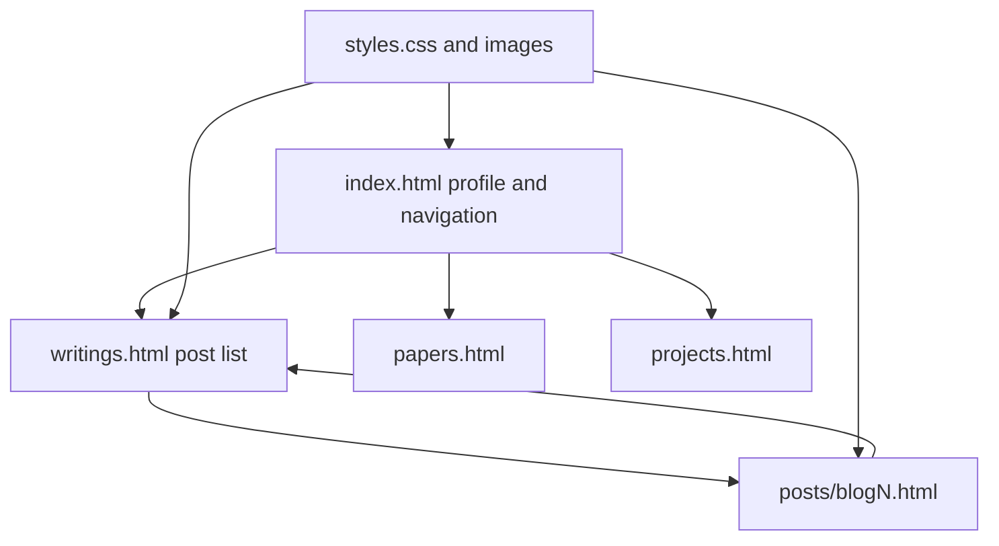

# Personal Website, explained for humans

This is a hand-written static portfolio and blog. The browser loads HTML pages, a shared stylesheet and images directly. There is no JavaScript application, backend, database or build step in the site source.

Read `index.html` first: its ordinary links connect the profile to the other pages. `writings.html` manually lists posts in a table. Each page in `posts/` contains its own article markup and a back link. `styles.css` defines the shared visual classes; some main-page formatting is inline. `images/` supplies the profile and article illustrations. `CNAME` supplies the custom-domain setting for hosting.

A new post needs both its HTML file and a listing link in `writings.html`; nothing discovers or indexes it automatically. Relative paths in a post point one directory upward to shared assets. The browser renders what is in the files, including any outdated biographical copy; this guide describes the implementation rather than certifying that copy as current.

The output is the rendered website. Broken paths produce missing images or missing pages; there is no application error handler. The existing hosting instructions describe direct GitHub Pages publication from the default branch. No code functions need annotation here. To understand a change, follow one homepage link to a listing, then a post, then its stylesheet and image references.
